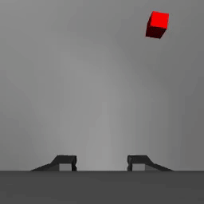
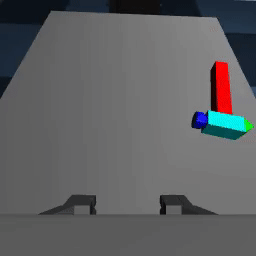
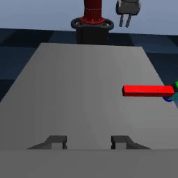
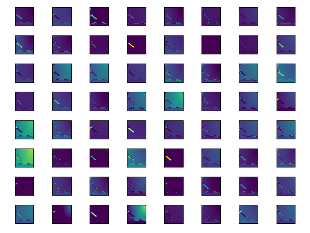
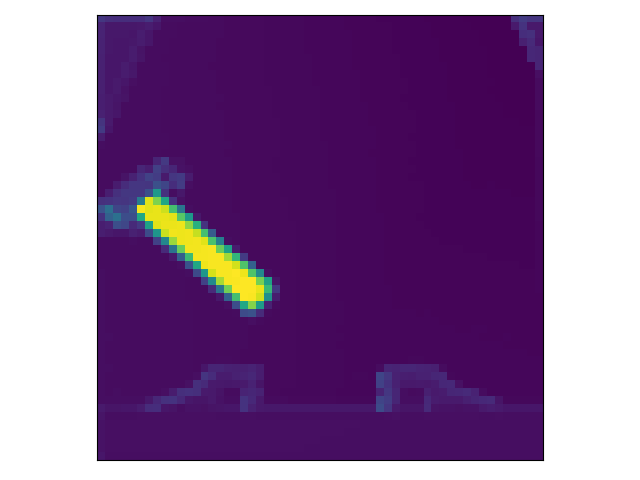

# RGB Proprioceptive Pose Estimator

A fully-learned pose estimator that leverages images from a single monocular RGB camera and proprioceptive measurements from a robot within the environment. The model is composed using Python and [PyTorch](https://github.com/pytorch/pytorch) and tested in simulation via [Robosuite](https://github.com/StanfordVL/robosuite) which leverages the [Mujoco](http://www.mujoco.org/) simulator.

This was a project for Stanford's [CS231N](http://cs231n.stanford.edu/) course on Convolutional Neural Networks during Spring 2020. The resulting report can be found [HERE](report.pdf), and corresponding presentation found [HERE](https://www.youtube.com/watch?v=Y1_A0j2Q8Gg).

Various trained models were trained and evaluated against the the following targets:
- cube (static object with simple geometry)
- hammer (static object with complex geometry)
- robotic end-effector (dynamic object with complex geometry)

Visualized results are shown below for each of the above targets, where the red sphere is a visualization of the model's real-time outputs:

#### Cube


#### Hammer


#### Robot EEF



## Installation
To install, please copy or clone this git repo into a folder of your choosing. Then, source a Python environment within which the program is to be run. The following packages must be included within your environment and can be installed as follows:

```pip install -r requirements.txt```

Note that Mujoco 2.0 must already be installed on your machine for [mujoco-py](https://github.com/openai/mujoco-py) to install successfully.

## Using this Repository

### Training a Model
To train a model, execute the following:

```python scripts/train_model.py [--ARGS...]```

For a full list and description of command line arguments, please see the source code at [train_model.py](scripts/train_model.py). Specific model architectures and features can be found in the [models](models) directory.

Note that Tensorboard is enabled during training. Thus, ongoing training runs can be actively observed by executing the following:

```tensorboard --logdir=scripts/runs```


### Evaluating a Trained Model
To evaluate a trained model, execute the following:

```python scripts/rollout.py --model MODEL_PATH [--ARGS...]```

Similar to the training script, please see the source code at [rollout.py](scripts/rollout.py) for a full list and description of each command line argument.

Of note, executing the rollout script will automatically store the per-step outputs in `model_outputs.npy`. Proceeding to run the rollout script again with additional command arguments `--model_outputs_file scripts/model_outputs.npy --record_video` will result in visualized model outputs using that trained model. Note that since the rollout script utilizes the same seed for random number generation, the "ground truth" trajectories will be identical between rollout executions for a given model.

Examples of output videos for each tested target can be seen at the top of this README.


### Visualizing Model Layers
To visualize a specific model's layer outputs, execute the following:

```python scripts/visualize_features.py [--ARGS...]```

where `[--ARGS...]` defines the specific model parameters; similar to the above scripts' arguments. Please see [visualize_features.py](scripts/visualize_features.py) for additional argument information.

Example visualization output from ResNet's BatchNorm1 layer for the Hammer target is shown below:



and the corresponding Auxiliary layer output from these batchnorm channels for the Hammer target is shown below:


